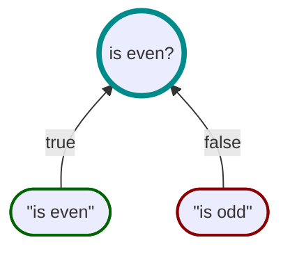

# Motiv

<div style="display: flex; justify-content: center;">


</div>

### Know _Why_, not just _What_

---

Motiv is a pragmatic solution to the _[Boolean Blindness](https://existentialtype.wordpress.com/2011/03/15/boolean-blindness/)_
problem (which is the loss of information resulting from the evaluation of logic to a single true or false value).
It achieves this by decomposing logical expressions into individual atomic [propositions](https://en.wikipedia.org/wiki/Proposition),
so that during evaluation, the specific causes of a decision can be preserved, and then put to use.
In most cases this will be a human-readable explanation of the decision, but it could equally be used to surface state.

To demonstrate Motiv in action:


```csharp
// Define the proposition
var isInRangeAndEven = Spec.From((int n) => n >= 1 & n <= 10 & n % 2 == 0)
                           .Create("in range and even");

// Evaluate proposition (typically elsewhere in your code)
var result = isInRangeAndEven.IsSatisfiedBy(11);

result.Satisfied;  // false
result.Assertions; // ["n > 10", "n % 2 != 0"]
result.Reason;     // "¬in range and even"
```


## Installation

Motiv is available as a [NuGet Package](https://www.nuget.org/packages/Motiv/).
Install it using one of the following methods:

**NuGet Package Manager Console:**
```bash
Install-Package Motiv
```

**.NET CLI:**
```bash
dotnet add package Motiv
```

## Usage

There are two main ways to create propositions in Motiv:

1. **[`Spec.Build()`](docs/builder/Build.md)**: For individual atomic propositions using a predicate function.
2. **[`Spec.From()`](docs/builder/From.md)**: Forgit a lambda expression tree into multiple atomic propositions.

### Build()

The `Spec.Build()` method is fundamental to creating propositions in Motiv.
It accepts a lambda function (which returns either a `bool` value,
a `BooleanResult<TMetadata>`, or `PolicyResult<TMetadata>`),
another proposition, or composition of propositions as its argument.


```csharp
Spec.Build((int n) => n % 2 == 0)
    .Create("is even");
```

### From()

The `Spec.From()` method is used to create a proposition from a lambda expression trees `Expression<Func<TModel, bool>>`.
This is the easiest way to use Motiv, as it allows you to create multiple propositions from a single lambda expression,
with each sub-expression being individually evaluated and expressed as an assertion in code form.
This is usful for debugging and troubleshooting complex logic.
However, these can be overridden with custom assertions if needed,
whilst still retaining the original expression (if required).

```csharp
Spec.From((int n) => n >= 1 & n <= 10 & n % 2 == 0)
    .Create("in range and even");
```

## Advanced Usage

### Explicit Assertions

For more descriptive results, use `WhenTrue()` and `WhenFalse()` to define custom assertions.
Continuing with the previous example, let's provide more explicit feedback when the number is odd:





```csharp
var isEven =
    Spec.Build((int n) => n % 2 == 0)
        .WhenTrue("is even")
        .WhenFalse("is odd")
        .Create();

var result = isEven.IsSatisfiedBy(3);

result.Satisfied;  // false
result.Reason;     // "is odd"
result.Assertions; // ["is odd"]
```

### Custom Metadata

For scenarios requiring more context, you can use metadata instead of simple string assertions.
For example, let's instead attach _metadata_ to our example:


```csharp
var isEven =
    Spec.Build((int n) => n % 2 == 0)
        .WhenTrue(new MyMetadata("even"))
        .WhenFalse(new MyMetadata("odd"))
        .Create("is even");

var result = isEven.IsSatisfiedBy(2);

result.Satisfied;  // true
result.Reason;     // "is even"
result.Assertions; // ["is even"]
result.Value;      // { Text: "even" }
```

### Composing Propositions

Motiv's true power shines when composing logic from simpler propositions, and then using their results to create new
assertions.
To demonstrate this,
we are going to solve the classic [Fizz Buzz](https://en.wikipedia.org/wiki/Fizz_buzz) problem using Motiv.
In this problem, we need to determine if a number is divisible by 3, 5, or both,
and then provide the appropriate feedback for each case.

Below is the flowchart of our solution:


This is then implemented in code as follows:

<iframe width="100%" height="475" src="https://dotnetfiddle.net/Widget/uYefQ8" frameborder="0"></iframe>

This example demonstrates how you can compose complex propositions from simpler ones using Motiv.

### Custom Types and Reuse

Motiv provides some classes to inherit from so that you can create your own strongly typed propositions which
can be reused across your codebase.

For example, let's create a strongly typed proposition to determine if a number is even:

```csharp
public class IsEven() : Spec<int>(
    Spec.Build((int n) => n % 2 == 0)
        .WhenTrue("is even")
        .WhenFalse("is odd")
        .Create();
```
This can then be instantiated where needed and used as-is.
Also, by making it strongly typed, you can ensure that there is no ambiguity when registering it with a DI container.

---

## When to Use Motiv

Motiv is not meant to replace all your boolean logic.
You should only use it when it makes sense to do so.
If your logic is pretty straightforward or does not really need any feedback about the decisions being made, then
you might not see a big benefit from using Motiv.
It is just another tool in your toolbox, and sometimes the simplest solution is the best fit.

Consider using Motiv when you need two or more of the following:

1. **Visibility**: Granular, real-time feedback about decisions
2. **Decomposition**: Break down complex logic into meaningful subclauses
3. **Reusability**: Avoid logic duplication across your codebase
4. **Modeling**: Explicitly model your domain logic (e.g., for
   [Domain-Driven Design](https://en.wikipedia.org/wiki/Domain-driven_design))
5. **Testing**: Test your logic in isolation—without mocking dependencies

### Tradeoffs

1. **Performance**: Motiv is not designed for high-performance scenarios where every nanosecond counts.
   Its focus is on maintainability and readability, although in most use-cases the performance overhead is negligible.
2. **Dependency**: Once embedded in your codebase, removing Motiv can be challenging.
   However, it does not depend on any third-party libraries itself, so it won't bring any unexpected baggage.
3. **Learning Curve**: New users may need time to adapt to Motiv's approach and API
